# Penguin Camera

Custom firmware for a cheap kids' instant camera that prints on thermal paper
(AX3295B SoC, board **AMG-05-3295B-V1**). It turns the camera into a small,
honest black-and-white photo printer: the screen shows what will print, you pick
a tone curve and a dithering style with the buttons, and every shot is printed.

<table>
  <tr>
    <td>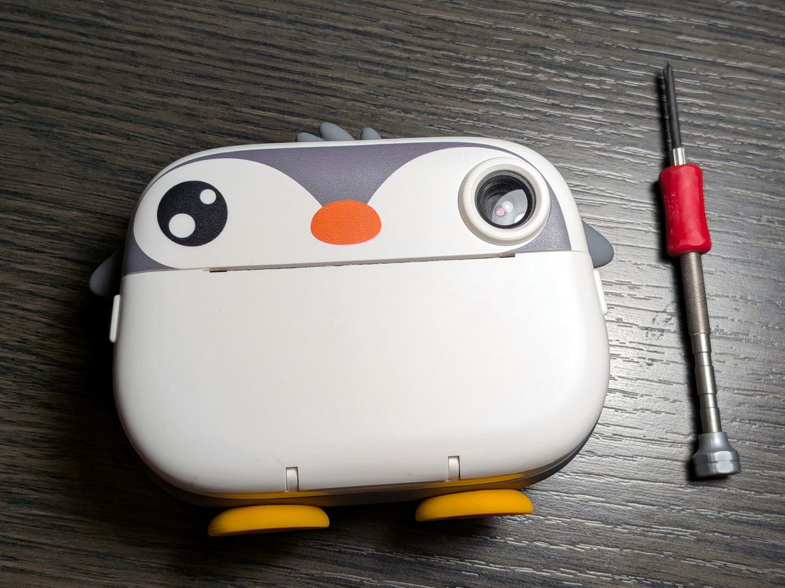</td>
    <td>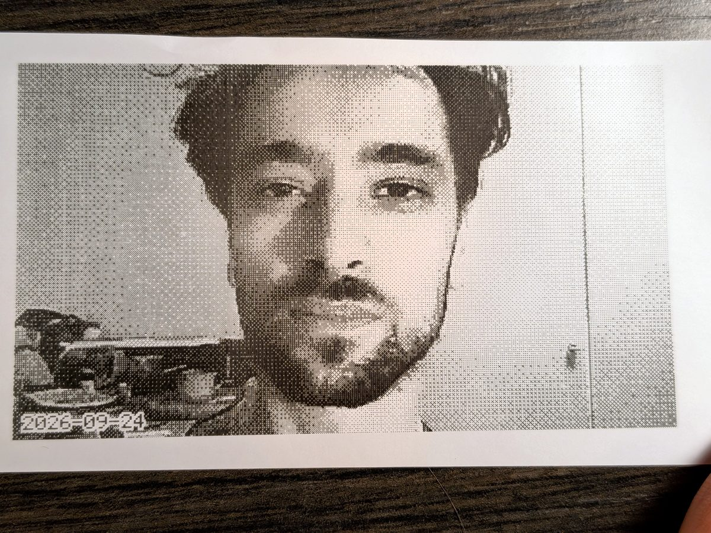</td>
  </tr>
  <tr>
    <td align="center">The camera</td>
    <td align="center">A print, with the date stamp bottom-left</td>
  </tr>
</table>

## Main changes compared to the stock firmware

- **Better quality prints.** The original prints have blown-out highlights; the
  print curve here was adjusted using spectrophotometer measurements of real prints.
- **Better black-and-white conversion.** The original firmware uses the JPEG luma
  (the Y channel); this firmware uses a formula that makes skin tones brighter.
- **What you see is what prints:** a gray preview that uses the same conversion
  as the printer, and every shot is printed. It is a print-only camera: photos
  are printed, not saved.
- **Tone curves** on the OK button, with **AUTO LEVELS** as the default. They
  replace the stock colour filters.
- **8 dithering styles**, switched on and off with one button, including two
  newspaper-like halftones.
- **Random penguin:** a new menu item that prints a random penguin picture,
  never the same one twice in a row.
- **Your own frames** (1 to 17) and **your own Random penguin pictures** (up to
  64): drop pictures into a folder and build.
- **Clean screen:** curve and dithering names, a clock, and a pictogram next to
  each button. No digital zoom, no kaleidoscope effects.
- **Simpler menu:** Camera · Settings · Random penguin. The camera starts
  straight in camera mode.
- **Custom splash screens** when the camera turns on and off.
- **Small fixes:** auto power-off counts from the last press of any button, and
  the date stamp follows the stock setting.

Everything is installed **over USB, without opening the camera**. The installer
keeps a full backup of your camera's flash, preserves your settings, and can put
the stock firmware back.

> ⚠️ This is unofficial firmware for one specific camera model. Flashing any
> device carries a risk of making it unusable (however, the installer is built so
> that this shouldn't happen). Read [Safety](#safety) first.

## What it does

**Camera screen**

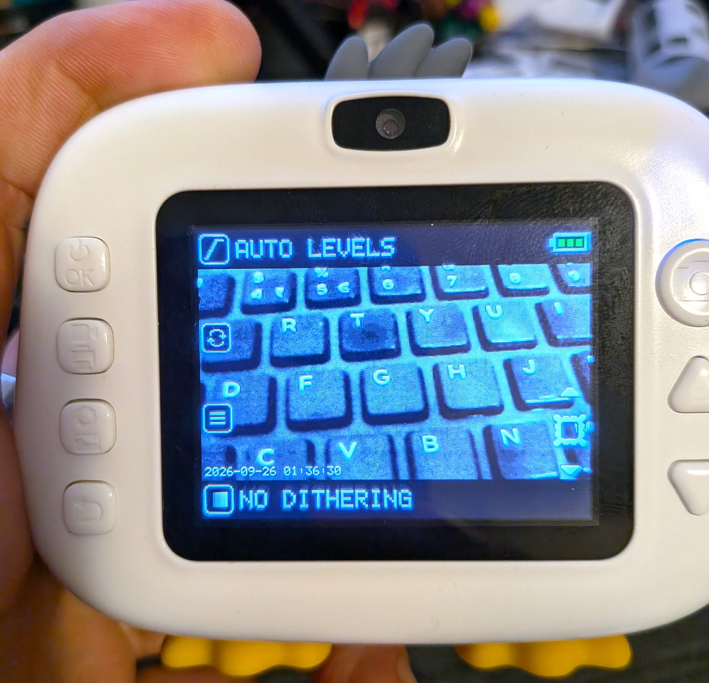

| Button (left side, top to bottom) | Action |
| --- | --- |
| 1 — OK / power | Tone curve: **AUTO LEVELS** (default) → FLAT CURVE → MORE CONTRAST → LIFT SHADOWS → TAME HIGHLIGHTS |
| 2 | Switch camera |
| 3 | Menu |
| 4 | Dithering on / off |
| Up / Down (right side) | Dithering on: choose the algorithm. Dithering off: choose a frame (only the frames from [`frames/`](#your-own-frames)) |
| Shutter | Take a photo — it is always printed |

- The preview is already gray and uses the same conversion as the print (a
  warm "orange filter" black-and-white: 0.55 R + 0.40 G + 0.05 B).
- Tone curves apply to the preview and the print, with or without dithering.
  AUTO LEVELS stretches every picture to the full black-to-white range; with a
  frame selected it measures only the photo, never the frame.
- Dithering algorithms: Bayer 8×8, Bayer 4×4, Floyd–Steinberg, Atkinson,
  Cracked, Error Diffusion 1D, Halftone 5×5, Halftone 6×6. The halftones
  soften the picture by one screen cell first (blur sigma = cell / 6), so each
  dot follows the local tone instead of breaking into fragments.
- Prints use a measured tone model of the thermal head (line load, heat
  history and head position are compensated) so grays come out as intended.
- The date is printed on photos when the stock *Settings → date/time* option is on.
- Screen: curve name on top, dithering name at the bottom, small clock, and a
  pictogram next to each button. The stock clock is hidden. No digital zoom
  (always 1.0×).
- Auto power-off counts from the last press of *any* button.

**Menu**: Camera · Settings · Random penguin (prints one of the pictures in [`penguins/`](#your-own-random-penguins),
never the same one twice in a row).
The shutter works like OK; button 4 always goes back to the camera.

<table>
  <tr>
    <td>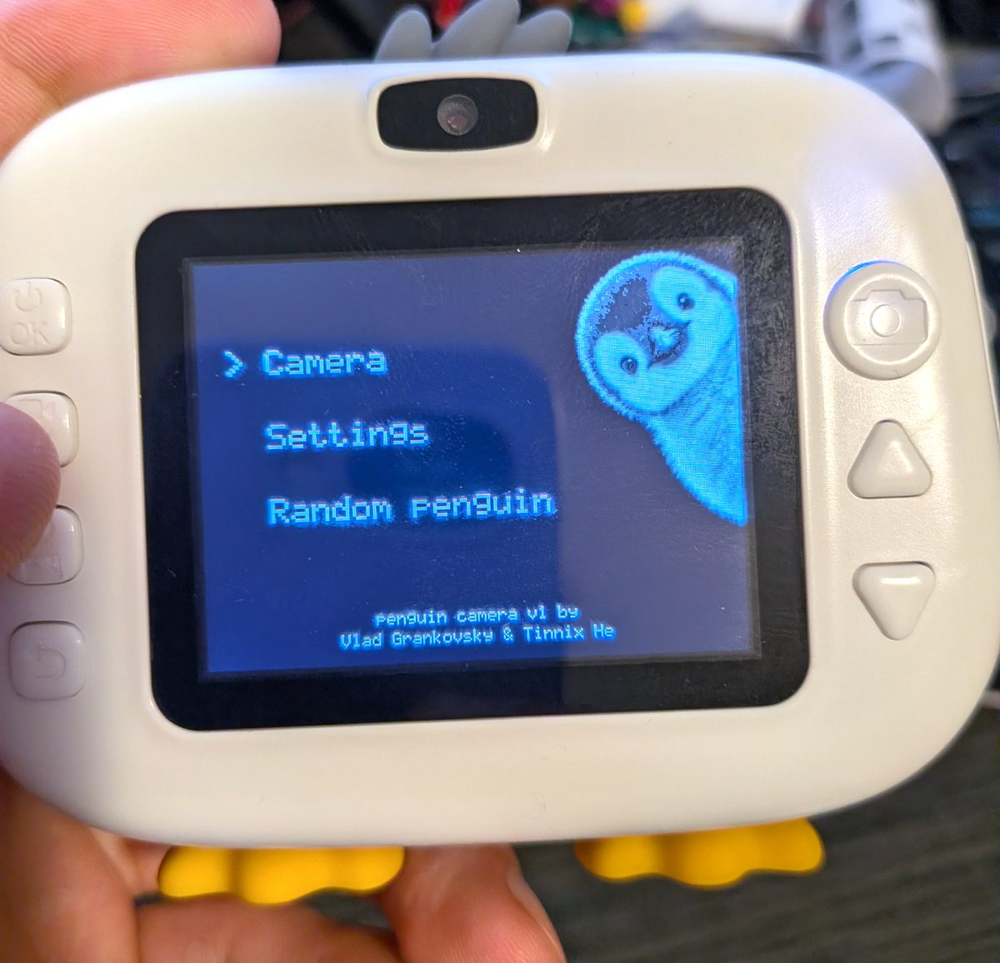</td>
    <td>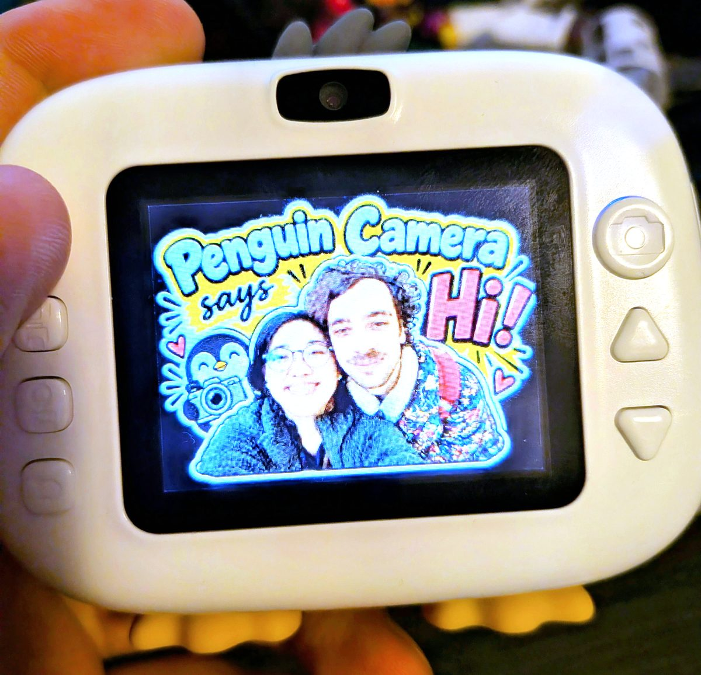</td>
  </tr>
  <tr>
    <td align="center">The menu</td>
    <td align="center">Power-on screen</td>
  </tr>
</table>

## Prints

Straight from the camera onto thermal paper: the 320×240 photo is turned
into black and white dots with the selected dithering style. The printer can only
print black or nothing, so all grays are made of dot patterns.

<table>
  <tr>
    <td>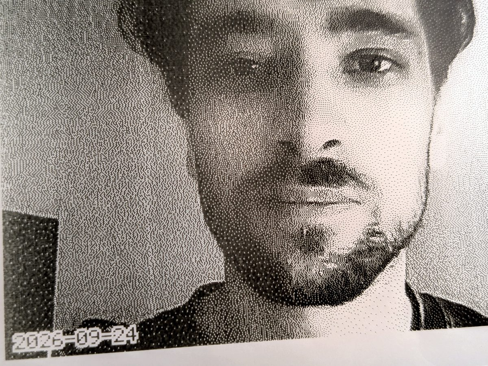</td>
    <td>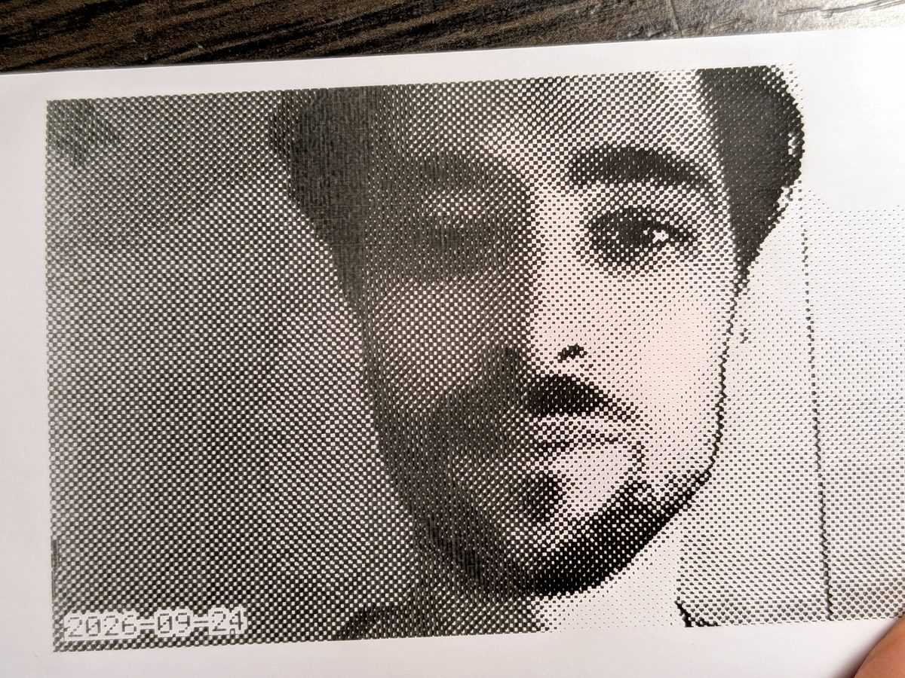</td>
    <td>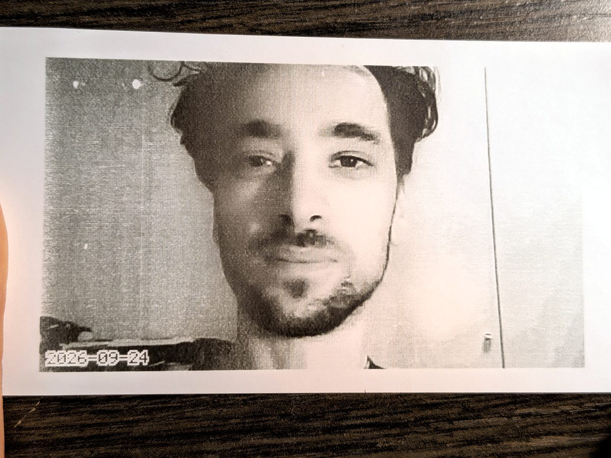</td>
  </tr>
</table>

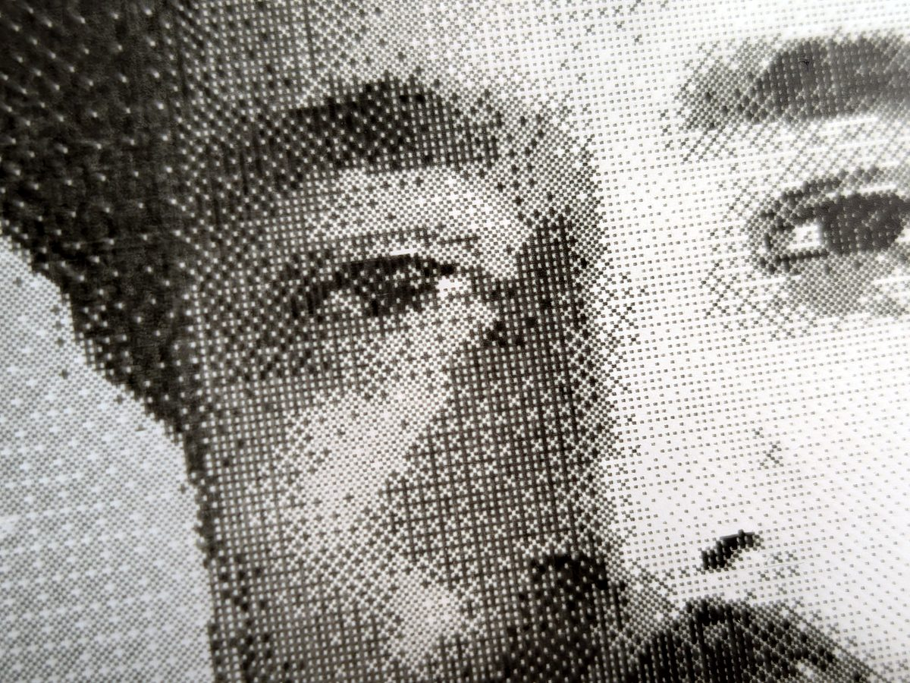

Close-up: each gray is a grid of dots of different sizes (a halftone screen),
like in a printed newspaper photo.

## Your own frames and penguins

Two folders decide what goes into the firmware. Change the pictures, then build
the image (see [Build from source](#build-from-source)) and install it. Your
image's SHA-256 will differ from the release (it contains your pictures); the
build lists every picture with its JPEG quality in `release-manifest.json`.

### Your own frames

Every picture in [`frames/`](frames) becomes a photo frame, in file-name order
(`1-…`, `2-…`, … — numbers sort naturally, so `10` comes after `9`). The camera
then offers exactly these frames: up/down goes none → frame 1 → … → last → none.

- **1 to 17 pictures** (the camera has 17 frame slots). The build uses the
  largest slots, so fewer frames get better JPEG quality.
- **640×360**, or any 16:9 picture (it is scaled; nothing is cropped).
- **Where the photo shows through:** the transparent pixels of a PNG — open one
  of the shipped frames in any image editor to see how they are made. Pictures
  without transparency also work: large pure-black areas become transparent
  (like the stock frames) and black details inside the artwork stay visible.

The shipped frames are the authors' own business cards; replace them with yours.

### Your own Random penguins

Every picture in [`penguins/`](penguins) is one *Random penguin* print; the
camera picks among exactly these.

- **1 to 64 pictures**, as many as fit into ~1.75 MiB of flash (typically 35–40
  photos; simple drawings take less). Any size and common format (PNG, JPEG, WebP, …).
- Printed in grayscale, 384 dots across. Landscape pictures are turned so their
  long side runs along the paper; nothing is cropped. A print is at most 1024
  dots long (~13 cm); taller pictures get white margins at the sides.
- Each is stored as a JPEG of at most 128 KiB (quality is lowered if needed).
  If they don't all fit, the build says how many bytes are missing.
- The shipped pictures are public-domain (NOAA) and CC0 photos from Wikimedia
  Commons, stored at print size; sources and photographers are listed in
  [`penguins/SOURCES.md`](penguins/SOURCES.md).

## Is my camera compatible?

The installer checks this for you and refuses anything else. You need:

- the camera to show up over USB as **`1908:3283`** (`lsusb`),
- stock firmware **`20250102 V2.6`** — the installer compares the whole 4 MiB
  flash with [`flash_zb25vq32_read1.bin`](flash_zb25vq32_read1.bin) (only the
  settings and internal-photo area may differ).

## Requirements

- Linux with Python ≥ 3.10 and libusb (tested on Ubuntu). macOS may work; untested.
- `pip install -r requirements.txt`
- USB access without sudo (optional):
  `sudo cp tools/udev/99-penguin-camera.rules /etc/udev/rules.d/ && sudo udevadm control --reload`
  (your user must be in the `plugdev` group), or run the commands with `sudo`.

## Install

1. Download `penguin-camera-<version>.bin` from the
   [Releases](../../releases) page and check it:
   `sha256sum -c penguin-camera-<version>.bin.sha256`
2. Charge the battery. Switch the camera on and connect it with a USB data
   cable. It shows its USB screen — leave it there; take out any memory card.
3. Install (takes a few minutes; it reads the whole flash twice first):

   ```bash
   python3 tools/penguin_flash.py install --image penguin-camera-<version>.bin --output runs/install
   ```

   `runs/install/before.bin` is a complete backup of your camera. Keep it.
4. Restart and check:

   ```bash
   python3 tools/penguin_flash.py restart --output runs/restart
   python3 tools/penguin_flash.py check --image penguin-camera-<version>.bin --output runs/check
   ```

   (Instead of `restart` you can switch the camera off and on.)

**Updating** from an earlier release: add the image you are updating from, so
the installer recognises what is on the camera:

```bash
python3 tools/penguin_flash.py install --image penguin-camera-NEW.bin \
    --known penguin-camera-OLD.bin --output runs/update
```

**Uninstalling** (back to stock, keeping your settings):

```bash
python3 tools/penguin_flash.py install --image flash_zb25vq32_read1.bin \
    --known penguin-camera-<installed>.bin --output runs/uninstall
```

Other commands: `backup` (two full reads, no writes) and `verify --image X`
(read-only: does the flash equal image X?). Every command needs a new `--output`
directory and keeps a journal there.

## Safety

The installer is deliberately strict:

- It writes nothing unless two full flash reads are identical and the flash is
  exactly a known image (stock, or one you pass with `--known`).
- The boot header is never written. Your settings (`0x1d7000`) and the
  internal-photo area (`0x1d8000–0x200000`) are always preserved.
- Only changed 4 KiB sectors are written, each through a tiny RAM routine that
  can erase/program exactly that sector; each sector is compared before and read
  back twice after writing.
- Installing writes the new boot loader sector **last**, only after the whole
  staged flash was verified and the loader was test-run in RAM. Uninstalling
  disables the loader **first**.
- There are no automatic retries.

**If anything fails after writing started: keep the camera powered and
connected, do not rerun, and read `journal.jsonl` in the output directory.**
Please open an issue with that directory (it contains your flash backup).

Last resort (a camera that no longer starts): read and restore the SPI flash
chip directly with a Raspberry Pi Pico — see [docs/RECOVERY.md](docs/RECOVERY.md).
Reading has been proven on real hardware; restoring has not.

## Inside the camera

The photos below were taken while working out how the camera works. You do
**not** need to open your camera to install the firmware.

| | |
| --- | --- |
| 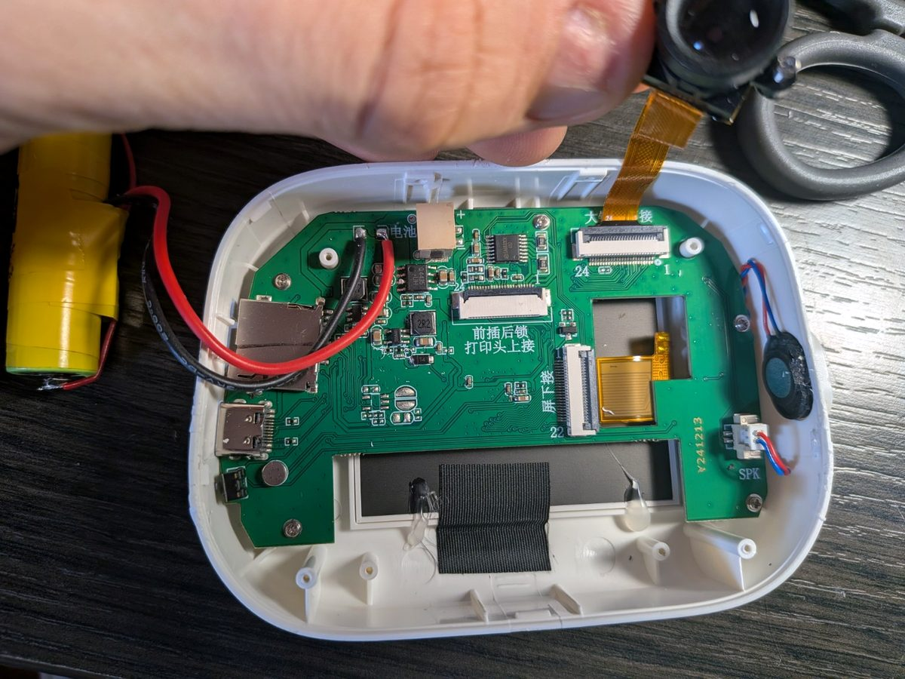 | **Opened camera.** Main board in the front shell, with the battery (yellow) and the speaker. |
| 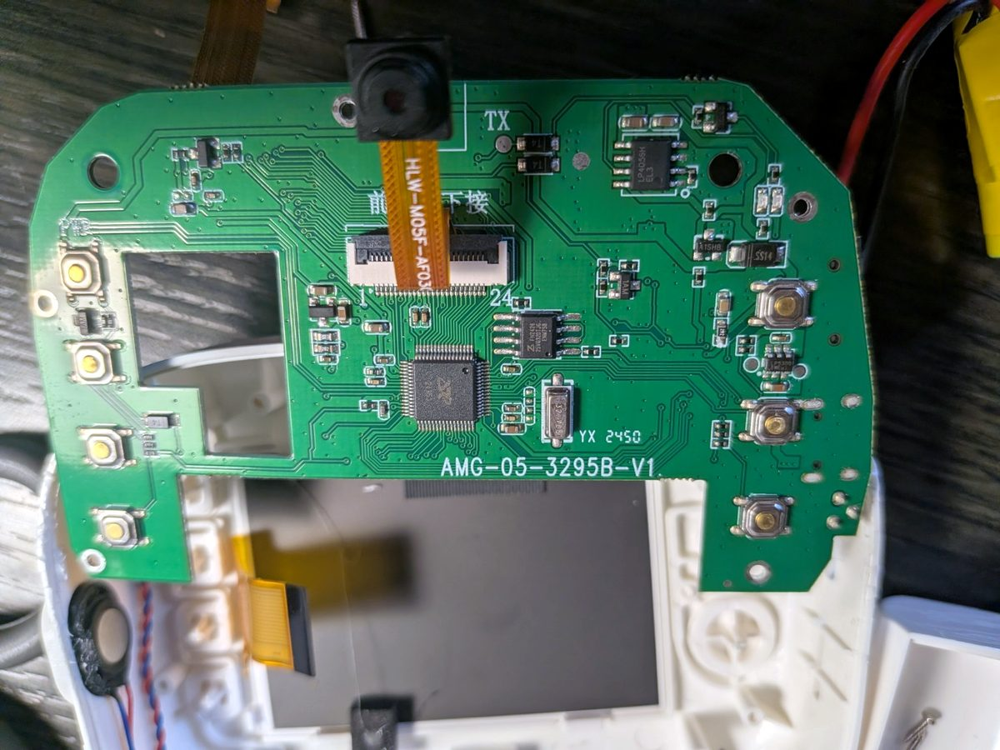 | **Main board AMG-05-3295B-V1.** AX3295B system-on-chip (the square chip), camera module on the orange ribbon, and the 4 MiB SPI flash that holds the firmware. The buttons are on this board too. |
| 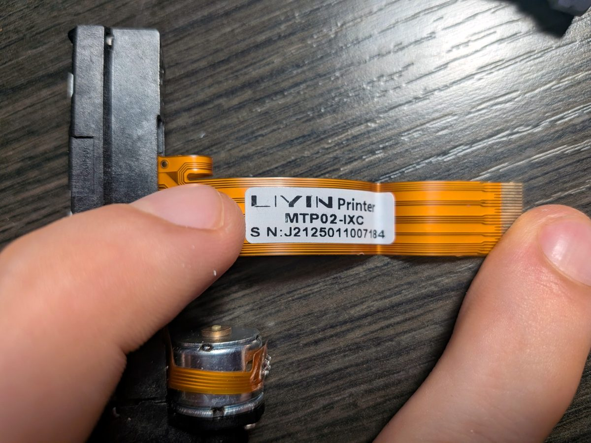 | **Thermal printer LIYIN MTP02-IXC.** 384 heating dots across the paper; the small motor feeds the paper. |
| 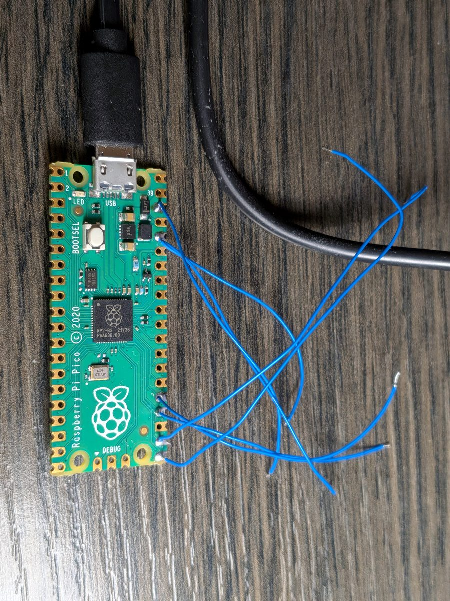 | **Raspberry Pi Pico as a flash reader.** Used once to copy the original firmware straight from the flash chip. The chip was desoldered from the board for this: when the board is powered, the AX3295B chip starts reading the flash at the same time and the two readers get in each other's way. It is also the last-resort recovery tool, see [docs/RECOVERY.md](docs/RECOVERY.md). |
| 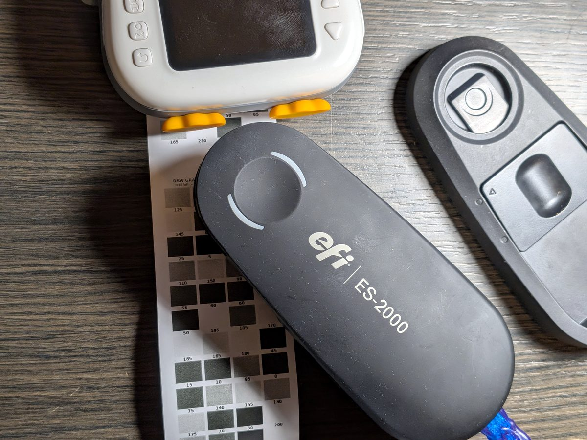 | **Measuring the printer.** A spectrophotometer (EFI ES-2000) read printed gray-step charts. From these measurements the firmware models how dark each dot really prints (heat build-up, line load, position on the head), so grays come out as intended. |

## Build from source

The release image is built reproducibly from the stock dump, the sources in
`tools/` and the files in `assets/`:

```bash
pip install -r requirements.txt
python3 tools/build_release.py --version 1.0 --output build
python3 -m unittest discover -s tools -p 'test_*.py'
```

The build emulates the camera's boot ROM to check the new image's header/CRC is
accepted, and prints the image's SHA-256 (it must match the release).

## Repository layout

| Path | Contents |
| --- | --- |
| `flash_zb25vq32_read1.bin` | Original stock firmware (4 MiB SPI flash dump) |
| `tools/penguin_flash.py` | Installer (backup / install / uninstall / restart / check / verify) |
| `tools/camera_usb.py` | USB access to the camera's stock USB mode |
| `tools/build_release.py` | Reproducible release build |
| `tools/*.py` | Firmware generators (OpenRISC code written from Python) and tests |
| `tools/recovery/` | Raspberry Pi Pico SPI-flash reader/restorer (last resort) |
| `frames/` | Photo frames (one picture per frame) |
| `penguins/` | *Random penguin* print pictures (one picture per print) |
| `assets/` | Power-on/off splash screens (`assets/splash-screens/`), menu penguin, tone model, boot ROM image |
| `docs/` | How it works, recovery, photos (`docs/images/`) |

See [docs/HOW-IT-WORKS.md](docs/HOW-IT-WORKS.md) for the technical design.

## License

Free for any non-commercial use. Code, docs and data:
[PolyForm Noncommercial 1.0.0](LICENSE.md). Artwork (`frames/`, penguins, screens):
[CC BY-NC 4.0](LICENSE-ARTWORK.md).
The stock firmware dump, the boot ROM image and third-party components keep
their own terms (see [LICENSE.md](LICENSE.md) and
[THIRD_PARTY_NOTICES.md](THIRD_PARTY_NOTICES.md)).

## Credits

Penguin camera by Vlad Grankovsky & Tinnix He. Error Diffusion 1D (and the
Magic 4×4 matrix still present in the code, not selectable) are adapted from
Robert Kist's libdither — see
[THIRD_PARTY_NOTICES.md](THIRD_PARTY_NOTICES.md).
