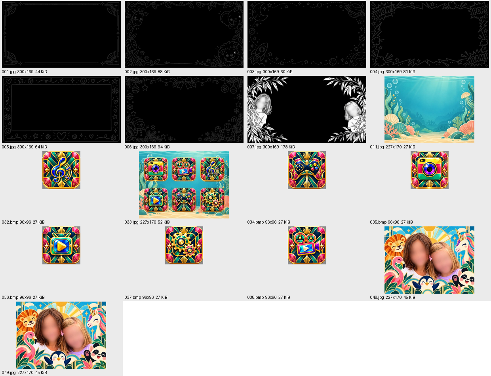

# MK1-3290-V2 camera variant

This is the **AX3291A / MK1-3290-V2** variant of the Penguin Camera project,
with a Zbit ZB25VQ32 4 MiB SPI flash, 8 MiB RAM and a 320×240 display.
It uses different addresses, firmware and controls from the AX3295B penguin.
Use the scripts in **this folder**, not the main penguin installer.

**For this camera, I decided to keep the menu and the other camera functions.**
The children who own it want to use the SD card, save photos and use the other
features. It therefore keeps the stock menu, settings and printing on/off
choice, rather than adopting the penguin's print-only, simplified-menu design.
The requested old photo effects were replaced; keeping the menu does not mean
keeping every stock effect.

## What we changed

- Seven custom photo frames, a menu background, six menu buttons, the composite
  menu picture, and power-on/off screens.
- Left/right photo selection: **normal → seven custom frames** on the left,
  and **normal → three effects** on the right; the selections wrap. Unmodified
  stock frames 8–10 remain in flash but are hidden.
- The right-hand effects are **Bayer 8×8 with Auto Levels**, **Halftone 6×6 with
  More Contrast**, and **Floyd–Steinberg with More Contrast**, available with
  printing on or off. Stock colour filters, kaleidoscope and both pencil/sketch
  variants were removed from this selection.
- Penguin black-and-white conversion, approximately **0.55 R + 0.40 G + 0.05 B**,
  its measured printer tone compensation, and its date stamp: black
  `YYYY-MM-DD`, white outline, bottom-left, following the original date setting.
- **White effect-name text with no background**, below the original information
  bar. It appears only on screen, never in saved photos or prints. The original
  top information bar is preserved.
- The USB selector always chooses the stock storage-mode descriptors, so the
  installed patch is intended to expose the flashing interface with or without
  an SD card. **This replaces the stock no-card webcam enumeration.** It does
  not add an SD card or storage media when none is inserted.
- Faster flashing transport: reliable 512-byte RAM uploads and resident SPI
  helpers, while retaining source checks, guarded writes and read-backs.
  Flash clock, printer heating and stock thermal safeguards were not increased.

## Current verification status

The original private **build_04** image was installed and the complete 4 MiB flash
read back successfully, preserving the live settings. Temporary RAM tests received the
owner's general approval; the information bar and label were then revised.
**A cold restart check and permanent USB access without an SD card were still
pending at the recorded handoff.** Do not describe those as hardware-proven.
There was no exhaustive physical test of every saved-photo/print/date combination.

The public example uses **blurred children’s faces** in frame 7 and both splash
screens, including editable sources, encoded resources and the overview. It
reproduces the installed application code exactly, with different artwork and
therefore different full-image hashes. The public artwork has been checked
offline; it was not flashed onto the owner’s camera during this privacy update.
The historical USB installer and resident application helpers were used on this
camera. The added
`mk1_artwork_flash.py` entry point supports other artwork using those helpers;
it has offline/native-emulator and simulated installer tests, **but has not
itself been used on hardware**. See [installation and customization](docs/WORKFLOW.md).

## Start here

From the repository root:

```bash
python3 -m pip install -r variants/mk1-3290-v2/requirements.txt
cd variants/mk1-3290-v2
python3 tools/build_variant.py
python3 -m unittest discover -s tools -p 'test_mk1*.py'
```

These commands build and test offline; they do not access a camera.
Generated images go into `analysis/build_01/` and `analysis/build_04/`, which are
ignored by Git. Builds refuse changed reference hashes. Keep the original dump
untouched. See [WORKFLOW.md](docs/WORKFLOW.md) before using any USB command.

| Reference | SHA-256 |
| --- | --- |
| Original `flash_read1.bin`, read twice with Pico | `33ac2db5716dacf06b60f97c5efbb2b2b77d820fe2b13e58c1eeb4379094fab5` |
| Public resources-only build_01 (blurred artwork) | `c1dd84025bc7ea79e64bfb1e8f83ca028d63996f071b7e4682e29f380c605ec0` |
| Public build_04, reference settings (blurred artwork) | `c50df9e03f36f38ba19f4f909f4eb350ab0ce913dbc23ff52ca96b32bd2216c3` |
| Historical private installed candidate, reference settings | `21d7cd67c810c993d82e11b452d3d864d0202e45a0889e0bcfa8e581dce0d1b2` |
| Actual installed build_04, this camera's live settings | `6a3e3218d5844d5e60972a6e1e6ef08fb5aec947b7a3b7b0c5ec60d03619a811` |

The historical installed hash includes the owner’s original artwork and live
settings; it cannot be reproduced from these blurred public assets. The installed
hash is specific to this unit. Another unit's settings can make its
full-image hash different; compare all other bytes and preserve its whole settings
sector. A matching model name or USB ID alone is insufficient compatibility proof.

## Guides and files

- [Installation and your own frames/graphics](docs/WORKFLOW.md): complete commands,
  initial install, customization, read-back and failure handling.
- [Firmware reference](docs/FIRMWARE.md): layout, addresses, effects, resource formats
  and USB protocol differences from the penguin.
- [Work log and evidence](docs/HISTORY.md): what succeeded, what failed, and what remains
  unverified. [Recorded installation summary](docs/installed-build-04.json).
- [Instructions for the next AI agent](AGENTS.md): scope, approval and compatibility rules.
- [Original offline analysis](docs/ANALYSIS-original.md): historical notes, superseded
  where the later guides report hardware results.
- `assets/source/`: editable source artwork; `assets/prepared/`: exact converted
  resources used for the reproducible reference build.
- [Script map](docs/TOOLS.md): purposes, hardware status and historical-only tools.
- `tools/`: resource extraction/conversion/builders, MK1 USB tools, native effects,
  ported penguin routines, and offline tests.
- `firmware/`: the copied penguin tone model and port provenance. The original
  development-source hashes are historical provenance, not hashes of these trimmed ports.



## Safety and licensing

Never erase the whole chip or the boot header. Preserve the live settings at
`0x2fd000`. Get the owner's explicit approval before **each flash-writing phase**;
review the exact candidate and changed sectors first. Eject an inserted card's
volume in the file manager, leaving the card in the camera, before claiming USB.
Do not put `DestBin.bin`, `SELFTEST.bin` or `exmend.bin` on the card for this workflow.
The stock card updater can overwrite protected areas.

If anything fails after writing starts, **keep the camera powered and connected,
retain the backups and journal, and stop**. There is no automatic retry or reset.
SPI recovery requires the MK1 dump and chip geometry, not the penguin firmware.

The repository's [code license](../../LICENSE.md), [artwork license](../../LICENSE-ARTWORK.md)
and [third-party notices](../../THIRD_PARTY_NOTICES.md) apply as described there.
The stock dump remains the manufacturer's firmware. Third-party subjects/artwork
keep their owners' terms; inclusion does not confer rights over them.
